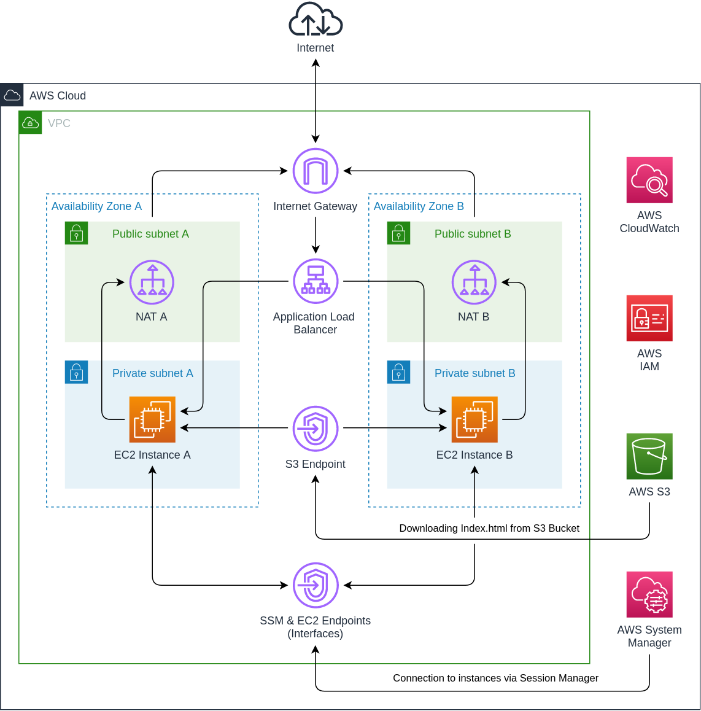

# Template homework
## About

This template is used for deploying a Virtual Private Cloud in Amazon Web Services. Template is creating a VPC with specified tags, specified amount of availability zones and specified amount of EC2 instances per each zone. You also can enable NAT Gateways for your instances in private subnets so they will have internet connection. 

You can connect to your instances in private subnets using the Session Manager from your AWS Console or AWS CLI using credentials. But you must to wait for several minutes for SSM manager to start. It may take from 1 to 10 minutes, but SSM will start anyway and you will be able to connect to your instances. You can create users in IAM and give them access to your VPC with different rights and policies. It is much easier and secure then creating a bastion host with exposed to the entire internet 22 port and a bunch of SSH keys.

After deployment you will be able to connect to the Application Load Balancer via its DNS. You can refresh page for several times to check that all instances is working fine.

## Requirements

* Terraform > 0.14
* Login to AWS CLI or exported credentials
* AWS CLI and login to it for script usage

## Features 

* Different parameters: you can choose region, amount of availability zones (cannot be less than 1) amount of EC2 per each zone, EC2 types and S3 Bucket name. 
* Session Manager instead of bastion host with SSH keys.
* You can enable or disable NAT for your instances in private subnets.
* CloudWatch alarms and auto recovery for every instance.
* Instances is secured and not exposed to the internet.
* [Wrapper script](AWS/Terraform/wrapper-script.sh) which you can use to manage your parameters. [README](AWS/Terraform/README.md) for wrapper script is in AWS/Terraform/README.md.

## Options

* Region
* Instance_Type
* Amount_of_Zones 
* EC2_Per_Zone    
* Enable_NAT      
* S3_Bucket_Name  
* Environment_Tag 
* Project_Tag     
* Owner_Tag       
 
## Updated diagram

Original diagram was updated for this homework. Endpoints for S3 Bucket and SSM was added. Without this endpoints instances from private subnets will not be able to connect to S3 Bucket and SSM Service.

Also public subnets and internet gateway was added to the diagram. Internet-facing load balancer is connected to the public subnets which are connected to the Internet Gateway. 

NAT Gateways for EC2 instances was added. Via this gateways instances are having internet access. NAT gateways can be disabled. 

<b>Updated VPC diagram:</b>

  

